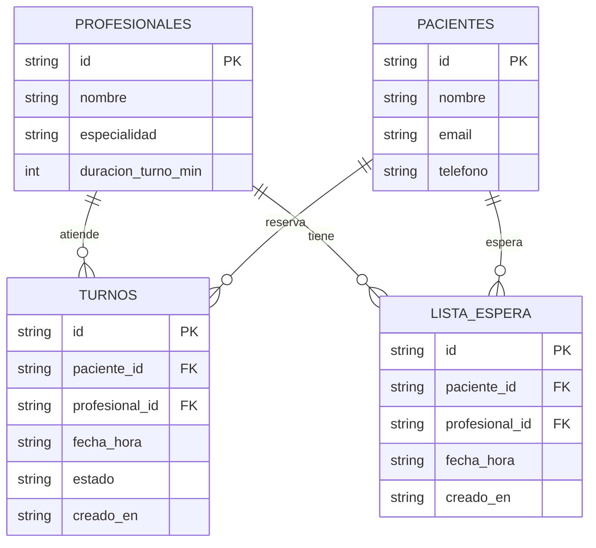

# 2. Modelo de datos

## Diagrama Entidad-Relacion

## Script DDL

El detalle completo esta en src/db/schema.sql. A nivel de reglas implementadas en la base de
datos, el estado de un turno queda restringido a reservado, cancelado o completado mediante un
CHECK constraint. Tambien existe una restriccion UNIQUE sobre profesional, fecha_hora y estado,
que evita que un mismo profesional tenga dos turnos reservados al mismo tiempo, reforzando a
nivel de base de datos la misma regla que ya se valida en TurnoService. Las claves foraneas usan
ON DELETE RESTRICT en turnos y ON DELETE CASCADE en lista de espera.

## Datos de prueba (seed)

Se ejecuta con npm run seed. Esto inserta dos profesionales, tres pacientes y un turno ya
reservado, pensado para poder probar manualmente el caso de "sin disponibilidad" descripto en el
diagrama de secuencia del Primer Parcial. El script completo esta en src/db/seed.js.